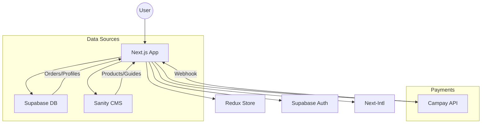

# Agrodyke - Modern Agricultural Platform 🚜🇨🇲

 
*Empowering Cameroonian farmers with data-driven tools and premium agricultural products.*

Agrodyke is a comprehensive e-commerce and advisory platform designed specifically for the agricultural landscape of Cameroon. It combines a robust shopping experience with intelligent dosage calculators and localized crop management guides.

## 🌟 Key Features

### 🛒 E-Commerce & Checkout
- **Localized Payments**: Seamless integration with **Campay** for Mobile Money (MTN & Orange) transactions.
- **Order Tracking**: Complete order history for users and an analytics dashboard for admins.
- **Multilingual Support**: Fully translated in English and French (Next-Intl).

### 🧮 Smart Agricultural Tools
- **Dosage Calculator**: Instantly calculate the exact amount of fertilizer, pesticide, or seeds needed for any field size.
- **Crop Management Guides**: Step-by-step instructions for popular crops (Cocoa, Tomato, Maize, etc.) powered by Sanity CMS.

### 📊 Admin Analytics
- **Live Dashboard**: Real-time sales visualization using **Recharts**.
- **Management**: Easy oversight of orders, customers, and inventory.

## 🛠 Tech Stack

| Layer | Technology |
|-------|------------|
| **Frontend** | [Next.js 16](https://nextjs.org/) (App Router), TypeScript, Tailwind CSS |
| **State Management** | [Redux Toolkit](https://redux-toolkit.js.org/) |
| **Database & Auth** | [Supabase](https://supabase.com/) |
| **Content Management** | [Sanity CMS](https://www.sanity.io/) |
| **Payments** | [Campay API](https://www.campay.net/) |
| **Visualizations** | [Recharts](https://recharts.org/) |
| **Internationalization** | [Next-Intl](https://next-intl-docs.vercel.app/) |

## 🚀 Getting Started

### Prerequisites
- [Bun](https://bun.sh/) runtime
- Supabase Project
- Sanity Studio Project
- Campay Sandbox Account

### Installation

1. **Clone the repository:**
   ```bash
   git clone https://github.com/Drax0001/agrodyke.git
   cd agrodyke
   ```

2. **Install dependencies:**
   ```bash
   bun install
   ```

3. **Configure Environment Variables:**
   Create a `.env.local` file based on `.env.example`:
   ```bash
   cp .env.example .env.local
   ```

4. **Run Development Server:**
   ```bash
   bun run dev
   ```

### 🌽 Populating Data (Sanity)
To seed the database with products and guides:
```bash
SANITY_API_TOKEN=your_token_here bun src/scripts/seed-sanity.ts
```

## 🏗 Architecture



## 📜 License
Distributed under the MIT License. See `LICENSE` for more information.

---
Built with ❤️ for the farmers of Cameroon.
